# Fatmug Assignment

This project is developed as a part of the Fatmug assignment. It includes functionalities related to managing purchase orders and vendors.

## Installation

1. Clone the repository:

```
git clone https://github.com/PhaleshM/Fatmug_Assignment.git
```

2. Navigate to the project directory:

```
cd Assignment
```

3. Create a virtual environment:

```
python -m venv env
```

4. Activate the virtual environment:

   - On Windows:

   ```
   .\env\Scripts\activate
   ```

   - On macOS and Linux:

   ```
   source env/bin/activate
   ```

5. Install dependencies:

```
pip install -r requirements.txt
```

6. Apply migrations:

```
python manage.py migrate
```

7. Run the development server:

```
python manage.py runserver
```

## API Endpoints

### Purchase Order Tracking

- List all purchase orders: `GET /api/purchase_orders/`
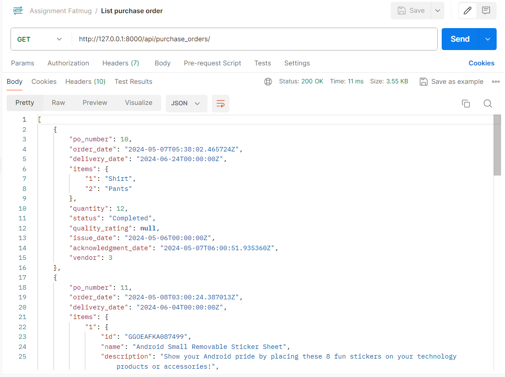
- Create a new purchase order: `POST /api/purchase_orders/`
```
{
    "vendor": "Raj",
    "delivery_date": "2024-06-04",
    "items": {
        "1":{
        "id": "GGOEAFKA087499",
        "name": "Android Small Removable Sticker Sheet",
        "description": "Show your Android pride by placing these 8 fun stickers on your technology products or accessories!",
        "features": "<p>8 Android stickers</p>\n<p>White colored sticker sheet</p>",
        "price": "2.99",
        "keywords": "Android Small Removable Sticker Sheet, android stickers, sticker sheets, removable sticker sheets, small sticker sheet, android small sticker sheets, Android Sheet",
        "url": "Android+Small+Removable+Sticker+Sheet",
        "category": "accessories",
        "subcategory": "accessories"
      }
    },
    "quantity": 12
}
```
- Retrieve a purchase order by ID: `GET /api/purchase_orders/<id>/`
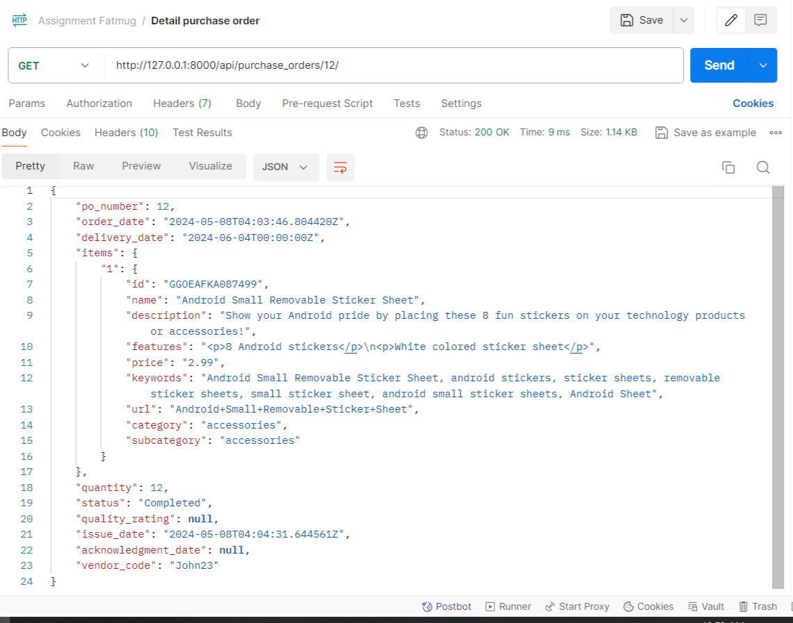
- Update a purchase order by ID: `PUT /api/purchase_orders/<id>/` or `PATCH /api/purchase_orders/<id>/`
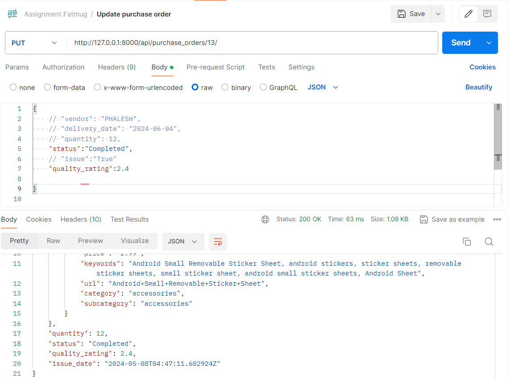
- Delete a purchase order by ID: `DELETE /api/purchase_orders/<id>/`
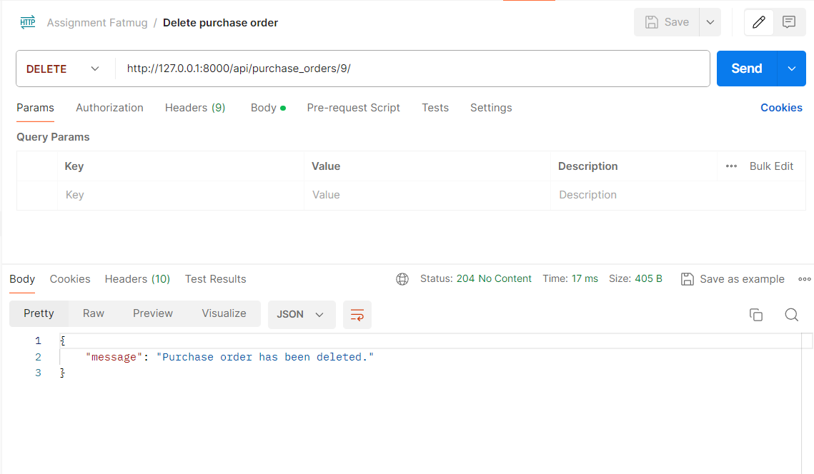

### Vendor Profile Management

- List all vendors: `GET /api/vendors/`
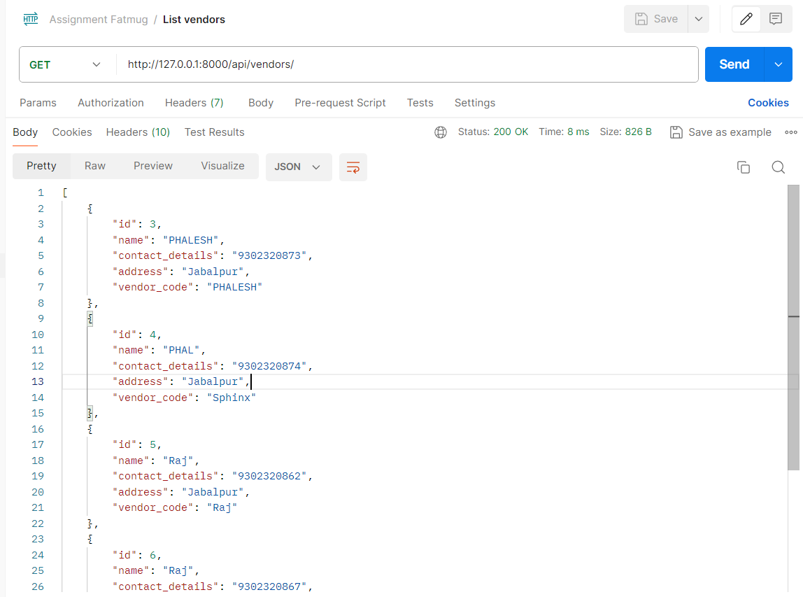
- Create a new vendor: `POST /api/vendors/`
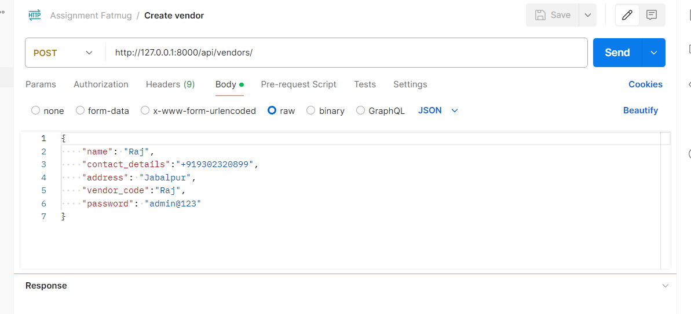
- Retrieve a vendor by ID: `GET /api/vendors/<id>/`
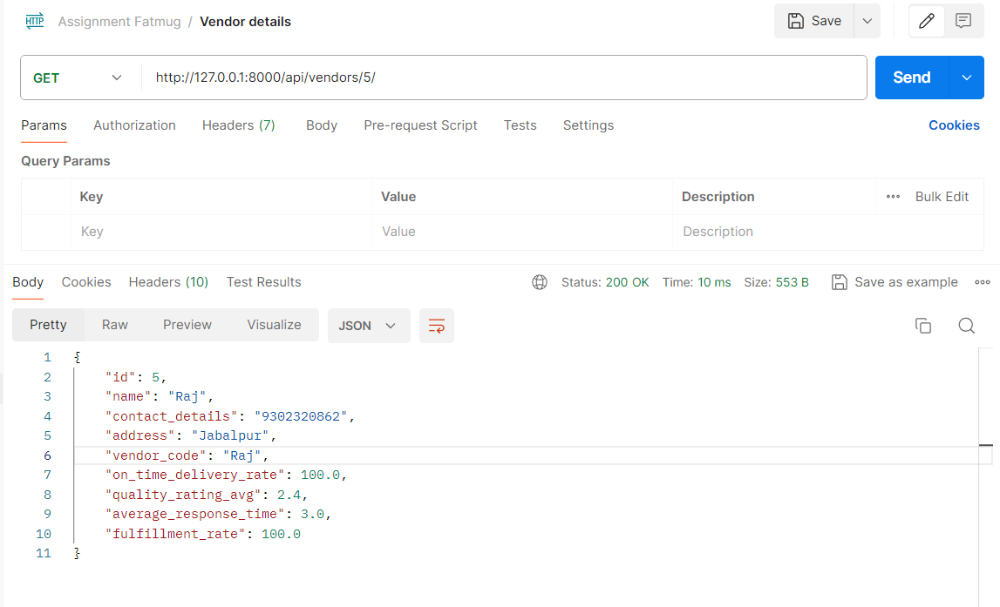
- Update a vendor by ID: `PUT /api/vendors/<id>/` or `PATCH /api/vendors/<id>/`
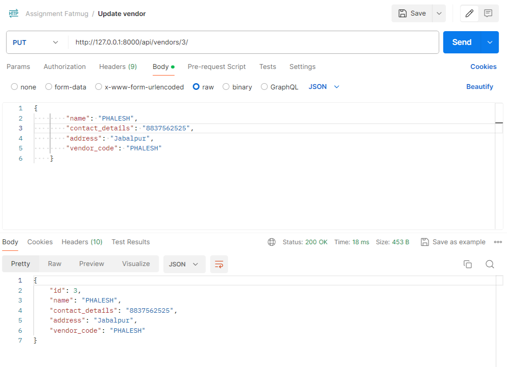
- Delete a vendor by ID: `DELETE /api/vendors/<id>/`
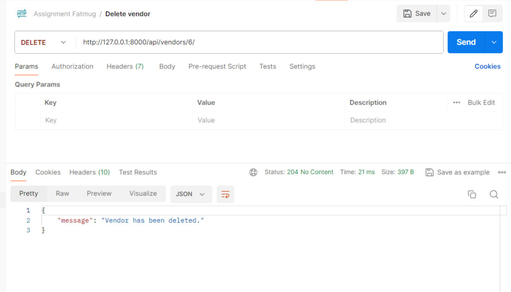

### Other

- Vendor Performance Endpoint: `GET /api/vendors/{vendor_id}/performance/`
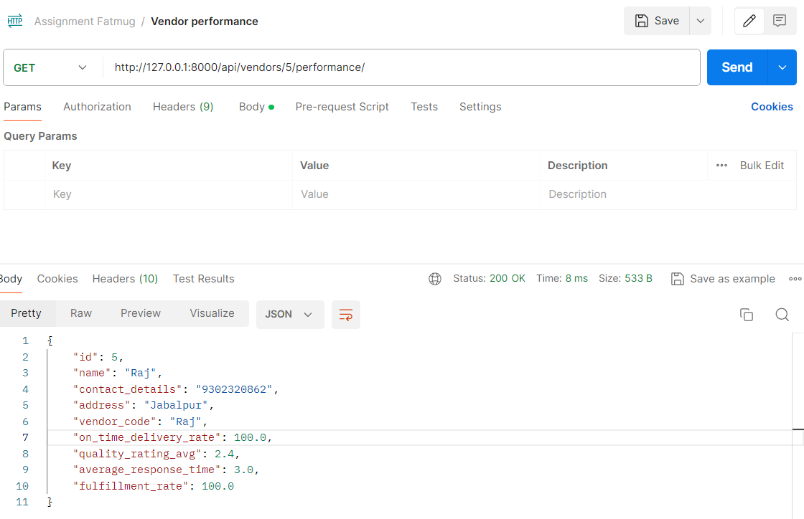
- Update Acknowledgment Endpoint: `POST /api/purchase_orders/{po_id}/acknowledge`
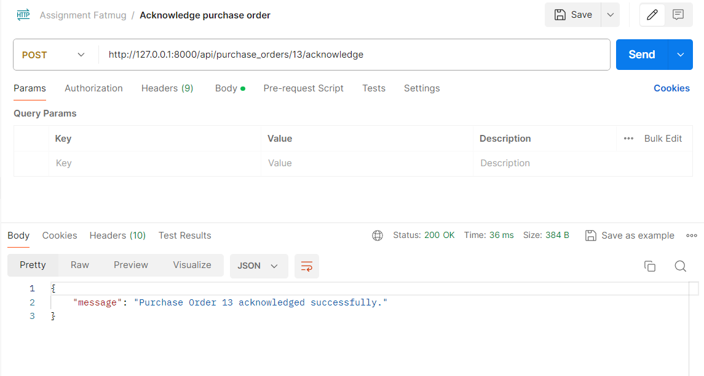

## Additional Notes

- Performance metrics are efficiently computed by utilizing existing data, ensuring quicker response times when handling large datasets.
- Upon saving a Purchase Order, the system automatically calculates new performance metrics and updates historical performance records.
- To flag an issue in the Update Purchase Order API call, include issue=TRUE in the request body.
- Postman Workspace: `https://grey-moon-811508.postman.co/workspace/My-Workspace~2d9e1d64-7e44-40e8-80ea-f093ea6f8db9/collection/23862377-3001c35c-62f6-4afd-8267-876f8f835102?action=share&creator=23862377`